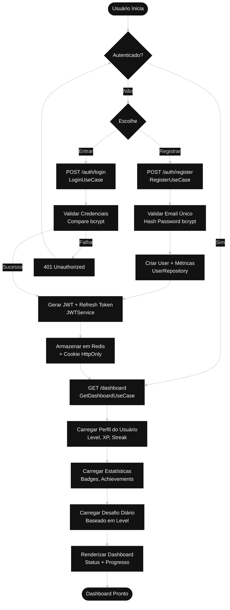

# Fluxo 1: Autenticação e Dashboard

## Descrição
Este diagrama representa o fluxo inicial do usuário na plataforma Journey, incluindo autenticação (registro/login) e acesso ao dashboard personalizado.

## Componentes
- **AuthController**: Controlador de autenticação
- **JWTService**: Gerenciamento de tokens JWT
- **UserRepository**: Acesso aos dados de usuários
- **DashboardService**: Agregação de dados do dashboard

## Diagrama

## Endpoints Relacionados
- `POST /auth/register` - Registro de novo usuário
- `POST /auth/login` - Login de usuário existente
- `POST /auth/refresh` - Renovar token JWT
- `GET /dashboard` - Obter dashboard personalizado

## Regras de Negócio
1. Email deve ser único no sistema
2. Senha deve ter mínimo 8 caracteres
3. JWT expira em tempo configurável (padrão: 1h)
4. Refresh token armazenado em Redis com TTL
5. Cookies com flags `httpOnly` e `secure` em produção
6. Rate limit: 5 tentativas de login a cada 15 minutos

## Segurança
- Bcrypt com salt 10+ para senhas
- JWT assinado com HS256
- HttpOnly cookies previnem XSS
- Rate limiting previne brute force
- Helmet middleware adiciona security headers
