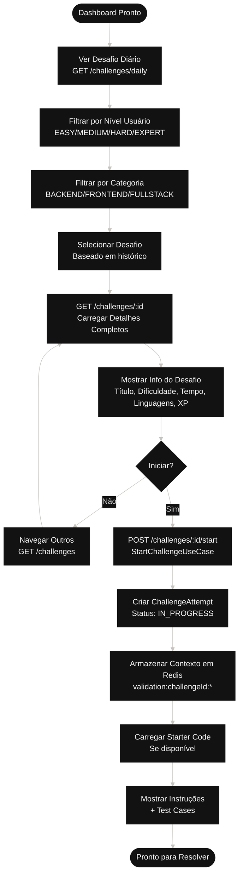

# Fluxo 2: Sistema de Desafios

## Descrição
Este diagrama mostra como os desafios são apresentados ao usuário, desde a seleção até o início da resolução. Inclui o sistema de níveis e categorias.

## Componentes
- **ChallengeController**: Gerencia requisições de desafios
- **StartChallengeUseCase**: Inicia tentativa de desafio
- **ChallengeRepository**: Persistência de desafios
- **ChallengeContextService**: Cache de contexto em Redis

## Diagrama

## Endpoints Relacionados
- `GET /challenges/daily` - Obter desafio diário personalizado
- `GET /challenges` - Listar todos os desafios disponíveis
- `GET /challenges/:id` - Obter detalhes de um desafio
- `POST /challenges/:id/start` - Iniciar tentativa de desafio

## Estrutura de um Desafio

### Níveis de Dificuldade
- **EASY**: Conceitos básicos, 10-15 min
- **MEDIUM**: Lógica intermediária, 20-30 min
- **HARD**: Algoritmos complexos, 40-60 min
- **EXPERT**: Desafios avançados, 60+ min

### Categorias
- **BACKEND**: APIs, bancos de dados, autenticação
- **FRONTEND**: UI, componentes, estado
- **FULLSTACK**: Integração completa
- **DEVOPS**: Deploy, CI/CD, containerização
- **MOBILE**: Apps nativos/híbridos
- **DATA**: Análise, processamento, ML

## Regras de Negócio
1. Desafio diário muda a cada 24h
2. Usuário pode ter múltiplas tentativas ativas
3. Contexto do desafio em cache por 24h
4. Starter code opcional para guiar iniciantes
5. Test cases públicos e privados
6. Hints liberados progressivamente
7. Traps (armadilhas) detectadas automaticamente

## Cache Strategy
- **Key Pattern**: `validation:{challengeId}:context`
- **TTL**: 86400s (24h)
- **Conteúdo**: keywords, tech stack, tópicos permitidos
