# Fluxo 3: Validação e Segurança de Prompts

## Descrição
Este é o coração da plataforma Journey. Mostra o sistema multi-camadas de validação de prompts para garantir uso seguro e educativo das IAs, evitando solicitações diretas de soluções, injection attacks e uso fora de contexto.

## Componentes
- **ValidatePromptUseCase**: Orquestra validação
- **PromptValidatorService**: Validação baseada em regex (6 etapas)
- **SemanticAnalyzerService**: Validação com IA (opcional)
- **RateLimiterService**: Controle de quotas

## Diagrama

```mermaid
%%{init: {'theme':'dark', 'themeVariables': { 'primaryColor':'#121212', 'primaryTextColor':'#fff', 'primaryBorderColor':'#121212', 'lineColor':'#c7c4bf', 'secondaryColor':'#121212', 'tertiaryColor':'#121212', 'background':'#121212', 'mainBkg':'#121212', 'secondBkg':'#1a1a1a', 'nodeBorder':'#121212', 'clusterBkg':'#121212', 'clusterBorder':'#121212', 'titleColor':'#fff', 'edgeLabelBackground':'#121212', 'nodeTextColor':'#fff'}}}%%

flowchart TD
    Start([Usuário Escreve Prompt])
    Start --> Submit[POST /ai/validate<br/>ValidatePromptUseCase]
    Submit --> CheckRate{Rate Limit OK?}

    CheckRate -->|Excedeu| RateError[429 Too Many Requests]
    CheckRate -->|OK| Layer1[Camada 1: Solicitação Direta]

    Layer1 --> Check1{Pede solução<br/>completa?}
    Check1 -->|Sim Risk=80| BlockDirect[BLOCKED: Padrão Detectado]
    Check1 -->|Não| Layer2[Camada 2: Relevância Contextual]

    Layer2 --> Check2{Relevante ao<br/>desafio?}
    Check2 -->|Score < 30%| WarnContext[WARNING Risk=40]
    Check2 -->|Sim| Layer3[Camada 3: Padrões Proibidos]

    Layer3 --> Check3{Regex<br/>proibidos?}
    Check3 -->|Match| WarnPattern[WARNING Risk=25]
    Check3 -->|Não| Layer4[Camada 4: Engenharia Social]

    Layer4 --> Check4{Tenta manipular<br/>IA?}
    Check4 -->|Sim Risk=90| BlockSocial[BLOCKED: Eng. Social]
    Check4 -->|Não| Layer5[Camada 5: Off-Topic]

    Layer5 --> Check5{Fora de<br/>contexto?}
    Check5 -->|Sim Risk=50| WarnOffTopic[WARNING: Off-Topic]
    Check5 -->|Não| Layer6[Camada 6: Complexidade]

    Layer6 --> Check6{Complexidade<br/>suspeita?}
    Check6 -->|Anomalia| WarnComplex[WARNING Risk=20]
    Check6 -->|OK| CalculateRisk[Calcular Risk Score]

    WarnContext --> CalculateRisk
    WarnPattern --> CalculateRisk
    WarnOffTopic --> CalculateRisk
    WarnComplex --> CalculateRisk

    CalculateRisk --> RiskDecision{Risk Score}
    RiskDecision -->|0-49| Approved[✅ APROVADO]
    RiskDecision -->|50-79| Throttled[⚠️ THROTTLE]
    RiskDecision -->|80-100| Rejected[❌ BLOQUEADO]

    BlockDirect --> Rejected
    BlockSocial --> Rejected

    Rejected --> ShowFeedback[Feedback Educativo<br/>+ Dicas + Exemplos]
    Throttled --> ShowWarning[Aviso + Sugestões]
    ShowWarning --> Approved

    ShowFeedback --> Retry{Tentar<br/>Novamente?}
    Retry -->|Sim| Start
    Retry -->|Não| SaveLog[Salvar ValidationLog]

    Approved --> SaveLog
    SaveLog --> NextStep([Prosseguir para IA])

    RateError --> Start

    style Start fill:#121212,stroke:#121212,color:#fff
    style NextStep fill:#121212,stroke:#121212,color:#fff
    style Submit fill:#121212,stroke:#121212,color:#fff
    style CheckRate fill:#121212,stroke:#121212,color:#fff
    style Layer1 fill:#121212,stroke:#121212,color:#fff
    style Layer2 fill:#121212,stroke:#121212,color:#fff
    style Layer3 fill:#121212,stroke:#121212,color:#fff
    style Layer4 fill:#121212,stroke:#121212,color:#fff
    style Layer5 fill:#121212,stroke:#121212,color:#fff
    style Layer6 fill:#121212,stroke:#121212,color:#fff
    style Check1 fill:#121212,stroke:#121212,color:#fff
    style Check2 fill:#121212,stroke:#121212,color:#fff
    style Check3 fill:#121212,stroke:#121212,color:#fff
    style Check4 fill:#121212,stroke:#121212,color:#fff
    style Check5 fill:#121212,stroke:#121212,color:#fff
    style Check6 fill:#121212,stroke:#121212,color:#fff
    style BlockDirect fill:#121212,stroke:#121212,color:#fff
    style BlockSocial fill:#121212,stroke:#121212,color:#fff
    style WarnContext fill:#121212,stroke:#121212,color:#fff
    style WarnPattern fill:#121212,stroke:#121212,color:#fff
    style WarnOffTopic fill:#121212,stroke:#121212,color:#fff
    style WarnComplex fill:#121212,stroke:#121212,color:#fff
    style CalculateRisk fill:#121212,stroke:#121212,color:#fff
    style RiskDecision fill:#121212,stroke:#121212,color:#fff
    style Approved fill:#121212,stroke:#121212,color:#fff
    style Throttled fill:#121212,stroke:#121212,color:#fff
    style Rejected fill:#121212,stroke:#121212,color:#fff
    style ShowFeedback fill:#121212,stroke:#121212,color:#fff
    style ShowWarning fill:#121212,stroke:#121212,color:#fff
    style Retry fill:#121212,stroke:#121212,color:#fff
    style SaveLog fill:#121212,stroke:#121212,color:#fff
    style RateError fill:#121212,stroke:#121212,color:#fff
```



## Endpoints Relacionados
- `POST /ai/validate` - Validar prompt antes de enviar para IA
- `POST /ai/chat` - Enviar prompt validado para IA escolhida

## As 6 Camadas de Validação

### 1. Detecção de Solicitação Direta (Risk: 80)
**Padrões Bloqueados**:
- Português: "me dá a solução", "resolve esse desafio", "código completo"
- Inglês: "give me the solution", "solve this challenge"

### 2. Verificação de Relevância Contextual (Risk: 40)
**Processo**:
- Extrai keywords do prompt
- Compara com contexto do desafio (cached)
- Calcula similaridade (Levenshtein distance)
- Threshold: 30% mínimo

### 3. Detecção de Padrões Proibidos (Risk: 25)
**Customizável**:
- Regex específicos por desafio
- Armazenados em `Challenge.validationRules`
- Permite bloquear termos técnicos específicos

### 4. Detecção de Engenharia Social (Risk: 90)
**Padrões Bloqueados**:
- "ignora as instruções anteriores"
- "finge que você é"
- "modo irrestrito"
- "bypass restrictions"
- "forget all instructions"

### 5. Off-Topic Detection (Risk: 50)
**Exemplos**:
- "conta uma piada"
- "como está o tempo"
- "receita de bolo"
- Qualquer assunto não relacionado a programação

### 6. Análise de Complexidade (Risk: 20)
**Métricas**:
- Contagem de palavras
- Número de sentenças
- Proporção de palavras técnicas
- Comparação com nível do usuário

## Sistema de Scoring

### Risk Score
```
0-49:   SAFE (ALLOW) ✅
50-79:  WARNING (THROTTLE) ⚠️
80-100: BLOCKED (BLOCK) ❌
```

### Confidence Score
```
Confidence = 100 - RiskScore
Ajustado por consistência de validações
```

## Análise Semântica (Opcional)

Quando `ENABLE_SEMANTIC_ANALYSIS=true`:

### Intent Classification (GPT-4)
- EDUCATIONAL: Aprendizado genuíno ✅
- CLARIFICATION: Dúvida específica ✅
- DEBUGGING: Ajuda com erro ✅
- SOLUTION_SEEKING: Quer resposta pronta ❌
- GAMING: Tentando burlar sistema ❌
- MANIPULATION: Engenharia social ❌
- OFF_TOPIC: Fora de contexto ⚠️
- UNCLEAR: Não consegue classificar ⚠️

### Embeddings (OpenAI)
- Model: `text-embedding-ada-002`
- Cache: 24h em Redis
- Similaridade por coseno

## Rate Limiting
- **Requests/minuto**: 20 (padrão)
- **Requests/hora**: 100 (padrão)
- **Tokens/dia**: 100.000 (padrão)
- **Burst limit**: 5 (padrão)

## Feedback Educativo

### Quando Bloqueado
1. Explica por que foi bloqueado
2. Mostra o padrão detectado
3. Fornece exemplos de prompts educativos válidos
4. Sugere reformulação específica

### Quando em Warning
1. Alerta sobre o problema potencial
2. Permite continuar com cautela
3. Registra para análise posterior
4. Pode afetar pontuação (Dependency Index)

## Auditoria e Compliance
- Todos os prompts salvos em `ValidationLog`
- Risk score e razões registradas
- Timestamp e contexto do desafio
- Útil para treinamento do modelo
- Compliance com políticas de uso de IA
