# Fluxo 4: Execução e Avaliação de Soluções

## Descrição
Este diagrama mostra o processo de submissão de soluções, integração com IAs (Claude/GPT-4), execução de código, e avaliação automática com detecção de armadilhas (traps).

## Componentes
- **SubmitSolutionUseCase**: Processa submissão de código
- **Judge0Service**: Compila e executa código em sandbox
- **AnalyzeCodeUseCase**: Analisa qualidade do código
- **TrapDetectorService**: Detecta conceitos errados
- **ProviderFactory**: Seleciona provider de IA

## Diagrama

```mermaid
%%{init: {'theme':'dark', 'themeVariables': { 'primaryColor':'#121212', 'primaryTextColor':'#fff', 'primaryBorderColor':'#121212', 'lineColor':'#c7c4bf', 'secondaryColor':'#121212', 'tertiaryColor':'#121212', 'background':'#121212', 'mainBkg':'#121212', 'secondBkg':'#1a1a1a', 'nodeBorder':'#121212', 'clusterBkg':'#121212', 'clusterBorder':'#121212', 'titleColor':'#fff', 'edgeLabelBackground':'#121212', 'nodeTextColor':'#fff'}}}%%

flowchart TD
    Start([Prompt Validado])
    Start --> SelectProvider{Escolher<br/>Provider IA}

    SelectProvider -->|Claude| ClaudeAPI[Anthropic Claude API]
    SelectProvider -->|GPT-4| OpenAIAPI[OpenAI API]

    ClaudeAPI --> CheckUsage[Verificar Usage<br/>Tokens + Custo]
    OpenAIAPI --> CheckUsage

    CheckUsage --> RateLimitCheck{Dentro da<br/>quota?}
    RateLimitCheck -->|Não| QuotaError[429 Quota Exceeded]
    RateLimitCheck -->|Sim| SendToAI[POST /ai/chat<br/>Enviar Prompt]

    SendToAI --> AIProcessing[IA Processa<br/>Gera Resposta]
    AIProcessing --> TrackTokens[Registrar Usage]
    TrackTokens --> AIResponse[Resposta da IA]

    AIResponse --> UserAction{Ação do<br/>Usuário}
    UserAction -->|Pedir ajuda| Start
    UserAction -->|Submeter| SubmitCode[POST /challenges/:id/submit]

    SubmitCode --> ValidateSubmission[Validar Código<br/>+ Linguagem]
    ValidateSubmission --> Judge0[Judge0 Sandbox]

    Judge0 --> CompileCode[Compilar]
    CompileCode --> CompileResult{Compilou?}
    CompileResult -->|Erro| CompileError[Erro Compilação]
    CompileResult -->|OK| RunTests[Executar Test Cases]

    RunTests --> CollectResults[Coletar Resultados]
    CollectResults --> CalculateMetrics[Calcular Métricas<br/>PR, DI, CS]

    CalculateMetrics --> AnalyzeCode[Análise de Qualidade]
    AnalyzeCode --> TrapDetection[Detectar Traps]

    TrapDetection --> CheckTraps{Traps?}
    CheckTraps -->|Sim| ShowTraps[Feedback Educativo]
    CheckTraps -->|Não| EvaluateSuccess{Testes OK?}

    ShowTraps --> PenalizeScore[Penalizar CS<br/>-10 pontos/trap]
    PenalizeScore --> EvaluateSuccess

    EvaluateSuccess -->|Não| PartialSuccess[Sucesso Parcial]
    EvaluateSuccess -->|Sim| FullSuccess[✅ Completo]

    PartialSuccess --> AllowRetry[Nova Tentativa]
    AllowRetry --> SaveAttempt[Salvar Attempt]

    FullSuccess --> SaveAttempt
    SaveAttempt --> NextFlow([Calcular XP])

    CompileError --> AllowRetry
    QuotaError --> Start

    style Start fill:#121212,stroke:#121212,color:#fff
    style NextFlow fill:#121212,stroke:#121212,color:#fff
    style SelectProvider fill:#121212,stroke:#121212,color:#fff
    style ClaudeAPI fill:#121212,stroke:#121212,color:#fff
    style OpenAIAPI fill:#121212,stroke:#121212,color:#fff
    style CheckUsage fill:#121212,stroke:#121212,color:#fff
    style RateLimitCheck fill:#121212,stroke:#121212,color:#fff
    style QuotaError fill:#121212,stroke:#121212,color:#fff
    style SendToAI fill:#121212,stroke:#121212,color:#fff
    style AIProcessing fill:#121212,stroke:#121212,color:#fff
    style TrackTokens fill:#121212,stroke:#121212,color:#fff
    style AIResponse fill:#121212,stroke:#121212,color:#fff
    style UserAction fill:#121212,stroke:#121212,color:#fff
    style SubmitCode fill:#121212,stroke:#121212,color:#fff
    style ValidateSubmission fill:#121212,stroke:#121212,color:#fff
    style Judge0 fill:#121212,stroke:#121212,color:#fff
    style CompileCode fill:#121212,stroke:#121212,color:#fff
    style CompileResult fill:#121212,stroke:#121212,color:#fff
    style CompileError fill:#121212,stroke:#121212,color:#fff
    style RunTests fill:#121212,stroke:#121212,color:#fff
    style CollectResults fill:#121212,stroke:#121212,color:#fff
    style CalculateMetrics fill:#121212,stroke:#121212,color:#fff
    style AnalyzeCode fill:#121212,stroke:#121212,color:#fff
    style TrapDetection fill:#121212,stroke:#121212,color:#fff
    style CheckTraps fill:#121212,stroke:#121212,color:#fff
    style ShowTraps fill:#121212,stroke:#121212,color:#fff
    style PenalizeScore fill:#121212,stroke:#121212,color:#fff
    style EvaluateSuccess fill:#121212,stroke:#121212,color:#fff
    style PartialSuccess fill:#121212,stroke:#121212,color:#fff
    style FullSuccess fill:#121212,stroke:#121212,color:#fff
    style AllowRetry fill:#121212,stroke:#121212,color:#fff
    style SaveAttempt fill:#121212,stroke:#121212,color:#fff
```



## Endpoints Relacionados
- `POST /ai/chat` - Enviar prompt validado para IA
- `POST /challenges/:id/submit` - Submeter solução de código
- `GET /challenges/:id/attempts` - Ver histórico de tentativas

## Providers de IA Suportados

### OpenAI (GPT)
- **Models**: gpt-4, gpt-4-turbo, gpt-3.5-turbo
- **API**: OpenAI SDK oficial
- **Features**: Chat completion, embeddings
- **Config**: `OPENAI_API_KEY`, `OPENAI_ORG_ID` (opcional)

### Anthropic (Claude)
- **Models**: Claude 3 (Opus, Sonnet, Haiku)
- **API**: Anthropic SDK oficial
- **Features**: Chat completion, análise de código
- **Config**: `ANTHROPIC_API_KEY`

## Judge0 Service

### Sandbox Execution
- **Isolamento**: Execução em container Docker
- **Segurança**: Limite de tempo, memória, e processos
- **Linguagens**: 60+ linguagens suportadas
- **API**: Judge0 CE (Community Edition)

### Limites de Execução
- **Tempo**: 5 segundos por teste (padrão)
- **Memória**: 256 MB (padrão)
- **Stack**: 64 MB
- **Processos**: 1 processo principal

## Métricas de Avaliação

### Pass Rate (PR)
```
PR = (Testes Aprovados / Total de Testes) × 100
Range: 0-100%
Peso: 40% da nota final
```

### Dependency Index (DI)
```
DI = (Hints Usados × 10) + (Prompts IA × 5)
Range: 0-100
Quanto menor, melhor (mais independente)
Peso: 40% da nota final
```

### Checklist Score (CS)
```
CS = Soma de verificações de qualidade
- Nomenclatura adequada
- Comentários úteis
- Tratamento de erros
- Performance
- Segurança
Range: 0-10
Peso: 20% da nota final
```

### Fórmula Final
```
Weighted Score = (100 - DI) × 0.4 + PR × 0.4 + (CS × 10) × 0.2
```

## Sistema de Traps (Armadilhas)

### O que são Traps?
Conceitos errados comuns que usuários podem aplicar. Sistema detecta e educa.

### Exemplos de Traps
```json
{
  "pattern": "eval\\(.*\\)",
  "severity": "high",
  "message": "Uso de eval() é inseguro",
  "educationalNote": "Prefira JSON.parse() para parsing seguro"
}
```

### Detecção
- Regex patterns no código
- Análise estática
- Comparação com anti-patterns conhecidos
- Penalização: -10 pontos no CS por trap

## Usage Tracking

### Métricas Rastreadas
- **Input Tokens**: Tamanho do prompt
- **Output Tokens**: Tamanho da resposta
- **Cost**: Custo estimado em USD
- **Response Time**: Latência da API
- **Provider**: OpenAI ou Anthropic
- **Model**: Modelo específico usado

### Alertas Automáticos
- Custo > $0.10 em uma requisição
- Tokens > 4000 em uma requisição
- Quota diária atingida

### Armazenamento
- **Redis**: Cache de curto prazo
- **PostgreSQL**: Histórico completo via Prisma

## Segurança na Execução

### Sandbox Isolation
1. Container Docker por execução
2. Sem acesso à rede
3. Sem acesso ao filesystem host
4. Limite de recursos (CPU, RAM)
5. Timeout automático

### Validação de Código
1. Verificação de linguagem suportada
2. Tamanho máximo do código
3. Scan de imports perigosos
4. Detecção de shell commands
5. Validação de sintaxe

## Feedback ao Usuário

### Em Caso de Sucesso
- Métricas completas (PR, DI, CS)
- Comparação com solução ideal
- Sugestões de melhoria
- XP ganho (prévia)

### Em Caso de Falha
- Erro específico encontrado
- Linha do erro (se disponível)
- Teste que falhou
- Entrada vs Saída esperada
- Dica contextual

### Em Caso de Traps
- Explicação do conceito errado
- Por que é problemático
- Solução correta
- Recursos para aprender mais
