# Fluxo 5: Pontuação e Progressão de Usuários

## Descrição
Este diagrama mostra o sistema de gamificação completo: cálculo de XP com múltiplos multiplicadores, badges, níveis, streaks, leaderboards e notificações em tempo real via WebSocket.

## Componentes
- **AwardXPUseCase**: Calcula e concede XP
- **XPCalculatorService**: Aplica multiplicadores complexos
- **UnlockBadgeUseCase**: Valida e desbloqueia badges
- **StreakManagerService**: Gerencia dias consecutivos
- **WebSocketServer**: Eventos em tempo real

## Diagrama

```mermaid
%%{init: {'theme':'dark', 'themeVariables': { 'primaryColor':'#121212', 'primaryTextColor':'#fff', 'primaryBorderColor':'#121212', 'lineColor':'#c7c4bf', 'secondaryColor':'#121212', 'tertiaryColor':'#121212', 'background':'#121212', 'mainBkg':'#121212', 'secondBkg':'#1a1a1a', 'nodeBorder':'#121212', 'clusterBkg':'#121212', 'clusterBorder':'#121212', 'titleColor':'#fff', 'edgeLabelBackground':'#121212', 'nodeTextColor':'#fff'}}}%%

flowchart TD
    Start([Desafio Completo])
    Start --> LoadMetrics[Carregar Métricas<br/>PR, DI, CS]
    LoadMetrics --> CalcXP[Calcular XP<br/>XPCalculatorService]

    CalcXP --> Mult1[Difficulty: 1.0x-3.0x]
    Mult1 --> Mult2[Performance: 0.85x-1.5x]
    Mult2 --> Mult3[First Try: 1.0x-1.25x]
    Mult3 --> Mult4[Independence: 0.75x-1.5x]
    Mult4 --> Mult5[Streak: 1.0x-1.5x]

    Mult5 --> FinalXP[XP Final = Base × Multiplicadores]
    FinalXP --> AwardXP[Conceder XP<br/>AwardXPUseCase]

    AwardXP --> CreateTransaction[Criar XPTransaction]
    CreateTransaction --> UpdateUser[Atualizar User.totalXp]

    UpdateUser --> CheckLevel{Subiu<br/>nível?}
    CheckLevel -->|Sim| LevelUp[Level Up]
    CheckLevel -->|Não| UpdateStreak[Atualizar Streak]
    LevelUp --> NotifyLevel[WS: level:up]
    NotifyLevel --> UpdateStreak

    UpdateStreak --> CheckStreakMS{Milestone<br/>Streak?}
    CheckStreakMS -->|Sim| NotifyStreak[WS: streak:updated]
    CheckStreakMS -->|Não| CheckBadges[Verificar Badges]
    NotifyStreak --> CheckBadges

    CheckBadges --> BadgeCheck{Badge<br/>desbloqueado?}
    BadgeCheck -->|Sim| CreateBadge[Criar UserBadge]
    BadgeCheck -->|Não| UpdateLeaderboard[Atualizar Leaderboard]

    CreateBadge --> NotifyBadge[WS: badge:unlocked]
    NotifyBadge --> BonusCheck{Rarity<br/>Bonus?}
    BonusCheck -->|LEGENDARY| BonusXP[+500 XP]
    BonusCheck -->|EPIC| BonusXP[+200 XP]
    BonusCheck -->|RARE| BonusXP[+100 XP]
    BonusCheck -->|COMMON| UpdateLeaderboard

    BonusXP --> UpdateLeaderboard
    UpdateLeaderboard --> RecalcRank[Recalcular Posição]
    RecalcRank --> NotifyLeaderboard[WS: leaderboard:updated]

    NotifyLeaderboard --> CreateNotif[Criar Notificações<br/>XP, Level, Badge]
    CreateNotif --> UpdateDashboard[Atualizar Dashboard]
    UpdateDashboard --> End([Ciclo Completo])

    style Start fill:#121212,stroke:#121212,color:#fff
    style End fill:#121212,stroke:#121212,color:#fff
    style LoadMetrics fill:#121212,stroke:#121212,color:#fff
    style CalcXP fill:#121212,stroke:#121212,color:#fff
    style Mult1 fill:#121212,stroke:#121212,color:#fff
    style Mult2 fill:#121212,stroke:#121212,color:#fff
    style Mult3 fill:#121212,stroke:#121212,color:#fff
    style Mult4 fill:#121212,stroke:#121212,color:#fff
    style Mult5 fill:#121212,stroke:#121212,color:#fff
    style FinalXP fill:#121212,stroke:#121212,color:#fff
    style AwardXP fill:#121212,stroke:#121212,color:#fff
    style CreateTransaction fill:#121212,stroke:#121212,color:#fff
    style UpdateUser fill:#121212,stroke:#121212,color:#fff
    style CheckLevel fill:#121212,stroke:#121212,color:#fff
    style LevelUp fill:#121212,stroke:#121212,color:#fff
    style NotifyLevel fill:#121212,stroke:#121212,color:#fff
    style UpdateStreak fill:#121212,stroke:#121212,color:#fff
    style CheckStreakMS fill:#121212,stroke:#121212,color:#fff
    style NotifyStreak fill:#121212,stroke:#121212,color:#fff
    style CheckBadges fill:#121212,stroke:#121212,color:#fff
    style BadgeCheck fill:#121212,stroke:#121212,color:#fff
    style CreateBadge fill:#121212,stroke:#121212,color:#fff
    style NotifyBadge fill:#121212,stroke:#121212,color:#fff
    style BonusCheck fill:#121212,stroke:#121212,color:#fff
    style BonusXP fill:#121212,stroke:#121212,color:#fff
    style UpdateLeaderboard fill:#121212,stroke:#121212,color:#fff
    style RecalcRank fill:#121212,stroke:#121212,color:#fff
    style NotifyLeaderboard fill:#121212,stroke:#121212,color:#fff
    style CreateNotif fill:#121212,stroke:#121212,color:#fff
    style UpdateDashboard fill:#121212,stroke:#121212,color:#fff
```



## Endpoints Relacionados
- `POST /gamification/award-xp` - Conceder XP ao usuário
- `POST /gamification/unlock-badge` - Desbloquear badge
- `GET /gamification/leaderboard` - Obter ranking global
- `GET /gamification/dashboard` - Dashboard de gamificação
- `GET /gamification/streak` - Ver status do streak

## Fórmula de XP Completa

```typescript
XP Final = Base XP (100)
  × Difficulty Multiplier (1.0 - 3.0)
  × Performance Bonus (0.85 - 1.5)
  × First Try Bonus (1.0 - 1.25)
  × Independence Bonus (0.75 - 1.5)
  × Streak Bonus (1.0 - 1.5)
```

### Exemplo de Cálculo

**Cenário**:
- Desafio HARD (2.0x)
- Weighted Score = 85 (1.3x)
- Segunda tentativa (1.0x)
- DI = 25 (1.5x muito independente)
- Streak = 15 dias (1.3x)

**Cálculo**:
```
XP = 100 × 2.0 × 1.3 × 1.0 × 1.5 × 1.3
XP = 507 pontos
```

## Sistema de Níveis

### Progressão Exponencial
```typescript
// Fórmula simplificada
xpForNextLevel = currentLevel * 100 * 1.5
```

### Exemplos
- Nível 1 → 2: 150 XP
- Nível 2 → 3: 225 XP
- Nível 10 → 11: 1.500 XP
- Nível 50 → 51: 7.500 XP
- Nível 100 (máximo): 15.000 XP

### Benefícios por Nível
- **1-10**: Desafios EASY
- **11-25**: Desafios MEDIUM desbloqueados
- **26-50**: Desafios HARD desbloqueados
- **51-75**: Desafios EXPERT desbloqueados
- **76-100**: Desafios LEGENDARY desbloqueados

## Sistema de Badges

### Tipos de Rarity

#### COMMON (1/10)
- Primeiro desafio completo
- 10 desafios completos
- Primeiro streak de 3 dias

#### RARE (1/50)
- 50 desafios completos
- Streak de 7 dias
- Nível 25 atingido

#### EPIC (1/100)
- 100 desafios completos
- Streak de 30 dias
- Nível 50 atingido
- Top 10 no leaderboard

#### LEGENDARY (1/500)
- 500 desafios completos
- Streak de 100 dias
- Nível 100 (máximo)
- Top 3 no leaderboard
- Todos desafios EXPERT completos

### Requirements Format
```json
{
  "type": "challenge_count",
  "value": 100,
  "difficulty": "HARD"
}
```

### Bonus XP por Rarity
- COMMON: +0 XP
- RARE: +100 XP
- EPIC: +200 XP
- LEGENDARY: +500 XP

## Sistema de Streak

### Regras
1. Incrementa quando usuário completa desafio
2. Verifica se último login foi há menos de 48h
3. Reset se passar 48h sem atividade
4. Pode usar "Streak Freeze" (item de loja)

### Milestones
- 3 dias: Badge "Consistente"
- 7 dias: Badge "Dedicado" + 1.15x XP
- 14 dias: Badge "Comprometido" + 1.3x XP
- 30 dias: Badge "Imparável" + 1.5x XP
- 100 dias: Badge LEGENDARY "Mestre da Disciplina"

### Notificações
- **Daily Reminder**: 20h se não completou desafio hoje
- **Streak Risk**: 36h sem atividade (12h antes do reset)
- **Streak Milestone**: Ao atingir 3, 7, 14, 30, 100 dias

## Leaderboard

### Tipos
1. **Global**: Todos os usuários
2. **Company**: Por empresa (B2B)
3. **Team**: Por time
4. **Friends**: Entre amigos

### Ranking Criteria
Ordenado por:
1. Total XP (principal)
2. Current Level (desempate)
3. Current Streak (desempate)
4. Challenges Completed (desempate)

### Cache Strategy
- **Redis**: Top 100 cached (TTL: 5 minutos)
- **Recalcula**: Após cada XP award
- **WebSocket**: Notifica mudanças de posição

## WebSocket Events

### Eventos Emitidos
```typescript
// XP Awarded
socket.emit('xp:awarded', {
  amount: 507,
  source: 'CHALLENGE',
  newTotal: 5234,
  levelProgress: 73.2
});

// Level Up
socket.emit('level:up', {
  newLevel: 15,
  xpForNextLevel: 2250,
  unlockedFeatures: ['HARD_CHALLENGES']
});

// Badge Unlocked
socket.emit('badge:unlocked', {
  badgeId: 'uuid',
  name: 'Century Club',
  rarity: 'EPIC',
  bonusXp: 200
});

// Streak Updated
socket.emit('streak:updated', {
  currentStreak: 15,
  milestone: true,
  bonusMultiplier: 1.3
});

// Leaderboard Change
socket.emit('leaderboard:updated', {
  newPosition: 42,
  previousPosition: 45,
  topPlayers: [...]
});
```

## Sistema de Notificações

### Tipos
- **achievement**: Badge desbloqueado, nível atingido
- **reminder**: Desafio diário disponível
- **milestone**: Streak milestone, XP milestone
- **level_up**: Subiu de nível
- **badge_unlock**: Novo badge
- **streak_risk**: Streak em risco de reset

### Prioridades
- **low**: Lembretes gerais
- **medium**: Conquistas comuns
- **high**: Level up, badges raros, streak risk

### Canais
1. **In-App**: Dashboard de notificações
2. **WebSocket**: Notificações em tempo real
3. **Email**: Resumo semanal (opcional)
4. **Push**: Lembretes críticos (futuro)

## Auditoria de XP

### XPTransaction Model
Registra cada mudança de XP:
- **amount**: Quantidade de XP (+/-)
- **reason**: Descrição textual
- **source**: CHALLENGE, BADGE, STREAK, BONUS, ACHIEVEMENT
- **balanceBefore**: XP antes da transação
- **balanceAfter**: XP após a transação
- **metadata**: JSON com detalhes adicionais
- **timestamp**: Data e hora exata

### Uso
- Auditoria financeira (se houver moeda real)
- Debug de cálculos
- Histórico completo do usuário
- Análise de progressão
- Compliance
