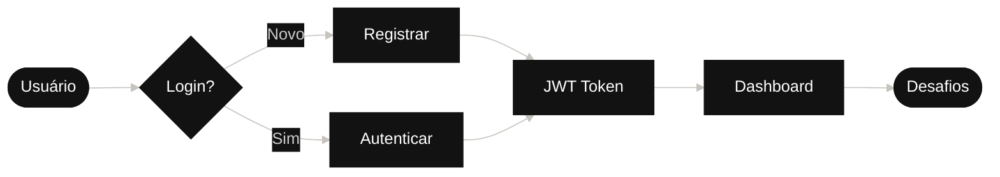

# Diagrama Simplificado 1: Autenticação e Dashboard

```mermaid
%%{init: {'theme':'dark', 'themeVariables': { 'primaryColor':'#121212', 'primaryTextColor':'#fff', 'primaryBorderColor':'#121212', 'lineColor':'#c7c4bf', 'secondaryColor':'#121212', 'tertiaryColor':'#121212', 'background':'#121212', 'mainBkg':'#121212', 'secondBkg':'#1a1a1a', 'nodeBorder':'#121212', 'clusterBkg':'#121212', 'clusterBorder':'#121212', 'titleColor':'#fff', 'edgeLabelBackground':'#121212', 'nodeTextColor':'#fff'}}}%%

flowchart LR
    A([Usuário]) --> B{Login?}
    B -->|Novo| C[Registrar]
    B -->|Sim| D[Autenticar]
    C --> E[JWT Token]
    D --> E
    E --> F[Dashboard]
    F --> G([Desafios])

    style A fill:#121212,stroke:#121212,color:#fff
    style B fill:#121212,stroke:#121212,color:#fff
    style C fill:#121212,stroke:#121212,color:#fff
    style D fill:#121212,stroke:#121212,color:#fff
    style E fill:#121212,stroke:#121212,color:#fff
    style F fill:#121212,stroke:#121212,color:#fff
    style G fill:#121212,stroke:#121212,color:#fff
```

**Pontos-chave:** JWT + Redis + Dashboard Personalizado
