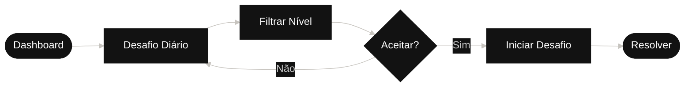

# Diagrama Simplificado 2: Sistema de Desafios

```mermaid
%%{init: {'theme':'dark', 'themeVariables': { 'primaryColor':'#121212', 'primaryTextColor':'#fff', 'primaryBorderColor':'#121212', 'lineColor':'#c7c4bf', 'secondaryColor':'#121212', 'tertiaryColor':'#121212', 'background':'#121212', 'mainBkg':'#121212', 'secondBkg':'#1a1a1a', 'nodeBorder':'#121212', 'clusterBkg':'#121212', 'clusterBorder':'#121212', 'titleColor':'#fff', 'edgeLabelBackground':'#121212', 'nodeTextColor':'#fff'}}}%%

flowchart LR
    A([Dashboard]) --> B[Desafio Diário]
    B --> C[Filtrar Nível]
    C --> D{Aceitar?}
    D -->|Sim| E[Iniciar Desafio]
    D -->|Não| B
    E --> F([Resolver])

    style A fill:#121212,stroke:#121212,color:#fff
    style B fill:#121212,stroke:#121212,color:#fff
    style C fill:#121212,stroke:#121212,color:#fff
    style D fill:#121212,stroke:#121212,color:#fff
    style E fill:#121212,stroke:#121212,color:#fff
    style F fill:#121212,stroke:#121212,color:#fff
```

**Pontos-chave:** Desafios Personalizados + Níveis (EASY → EXPERT) + Cache Redis
