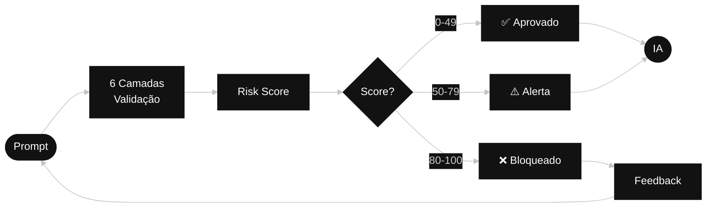

# Diagrama Simplificado 3: Validação e Segurança ⭐

```mermaid
%%{init: {'theme':'dark', 'themeVariables': { 'primaryColor':'#121212', 'primaryTextColor':'#fff', 'primaryBorderColor':'#121212', 'lineColor':'#c7c4bf', 'secondaryColor':'#121212', 'tertiaryColor':'#121212', 'background':'#121212', 'mainBkg':'#121212', 'secondBkg':'#1a1a1a', 'nodeBorder':'#121212', 'clusterBkg':'#121212', 'clusterBorder':'#121212', 'titleColor':'#fff', 'edgeLabelBackground':'#121212', 'nodeTextColor':'#fff'}}}%%

flowchart LR
    A([Prompt]) --> B[6 Camadas<br/>Validação]
    B --> C[Risk Score]
    C --> D{Score?}
    D -->|0-49| E[✅ Aprovado]
    D -->|50-79| F[⚠️ Alerta]
    D -->|80-100| G[❌ Bloqueado]
    G --> H[Feedback]
    H --> A
    E --> I([IA])
    F --> I

    style A fill:#121212,stroke:#121212,color:#fff
    style B fill:#121212,stroke:#121212,color:#fff
    style C fill:#121212,stroke:#121212,color:#fff
    style D fill:#121212,stroke:#121212,color:#fff
    style E fill:#121212,stroke:#121212,color:#fff
    style F fill:#121212,stroke:#121212,color:#fff
    style G fill:#121212,stroke:#121212,color:#fff
    style H fill:#121212,stroke:#121212,color:#fff
    style I fill:#121212,stroke:#121212,color:#fff
```

**Pontos-chave:** 6 Camadas + Risk Scoring + Feedback Educativo (CORE DA PLATAFORMA)
