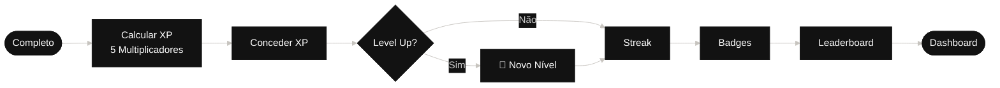

# Diagrama Simplificado 5: Pontuação e Gamificação

```mermaid
%%{init: {'theme':'dark', 'themeVariables': { 'primaryColor':'#121212', 'primaryTextColor':'#fff', 'primaryBorderColor':'#121212', 'lineColor':'#c7c4bf', 'secondaryColor':'#121212', 'tertiaryColor':'#121212', 'background':'#121212', 'mainBkg':'#121212', 'secondBkg':'#1a1a1a', 'nodeBorder':'#121212', 'clusterBkg':'#121212', 'clusterBorder':'#121212', 'titleColor':'#fff', 'edgeLabelBackground':'#121212', 'nodeTextColor':'#fff'}}}%%

flowchart LR
    A([Completo]) --> B[Calcular XP<br/>5 Multiplicadores]
    B --> C[Conceder XP]
    C --> D{Level Up?}
    D -->|Sim| E[🎉 Novo Nível]
    D -->|Não| F[Streak]
    E --> F
    F --> G[Badges]
    G --> H[Leaderboard]
    H --> I([Dashboard])

    style A fill:#121212,stroke:#121212,color:#fff
    style B fill:#121212,stroke:#121212,color:#fff
    style C fill:#121212,stroke:#121212,color:#fff
    style D fill:#121212,stroke:#121212,color:#fff
    style E fill:#121212,stroke:#121212,color:#fff
    style F fill:#121212,stroke:#121212,color:#fff
    style G fill:#121212,stroke:#121212,color:#fff
    style H fill:#121212,stroke:#121212,color:#fff
    style I fill:#121212,stroke:#121212,color:#fff
```

**Pontos-chave:** XP (5 multiplicadores) + Níveis + Badges + Streaks + Leaderboard + WebSocket
